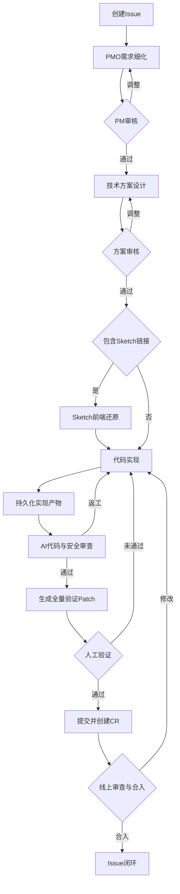

# UOS AI 开发小队实践

> 日期：2026-08-04
>
> 适用范围：QtWebEngine、Qt/C++、WebChannel、Vue/TSX 等跨端研发需求。

本文描述 UOS AI 开发小队当前采用的角色编组、阶段流程、交付标准和人工职责。通用的 Multica 配置与协作规则见 [最佳实践规则.md](./最佳实践规则.md)，完整流程图见 [workstream.md](./workstream.md)。

## 1. 目标与输入

小队接收产品经理创建的一条完整需求 Issue，并在同一 Issue 中完成需求细化、方案设计、代码实现、代码审查、人工验证、提交发布和合入闭环。

实践目标：

- 每个阶段有明确责任人、输入、产物和完成条件。
- 产品意图、技术方案、真实环境验证和远端合入由人最终确认。
- 所有角色围绕同一流程基线工作，避免跨 runtime 和 worktree 的代码漂移。
- 实现与验证产物可恢复、可传输、可追溯。
- Issue 保留正式记录，企业微信只承担人工提醒。

## 2. 小队编组

小队由四个核心智能体和一个按需智能体组成。路由规则由小队指令承载，不设置独立路由智能体。

```text
UOS AI 开发小队
├── 👑PM/O：需求细化并确定流程基线
│   └── skills: grill-me, send-wecom-webhook
├── planner：产出技术实现方案
│   └── skills: plan-writer
├── coder：全栈实现、产物持久化、提交发布
│   └── skills: beauty-commit, frontend-design
├── AI review：功能、质量、安全审查与验证 patch 交付
│   └── skills: code-security-check, deepin-code-aicheck
└── sketch impl（按需）：Sketch 前端还原
    ├── skills: frontend-design, sketch-design-to-code
    └── MCP: sketch-mcp
```

### 2.1 核心智能体

| 角色 | 主要输入 | 核心职责 | 主要产物 | 缺失影响 |
|---|---|---|---|---|
| 👑PM/O | 初始 Issue、评论、目标仓库和分支 | 对照代码现状细化需求；确定并锁定流程基线 | 需求细化结果、流程基线、待 PM 决策项 | 需求歧义和基线漂移进入后续阶段 |
| planner | 已审核需求、流程基线 | 明确目标文件、交互路径、实现步骤、验收映射、边界和风险 | 技术实现方案、方案基线 | coder 被迫边设计边实现，增加越界和返工风险 |
| coder | 已审核方案、流程基线、可选前端实现 patch | 完成全栈实现并持久化；人工验证通过后提交、push 和创建 CR | WIP commit 或 gzip 实现 patch、代码提交、Commit Report | 实现和最终提交缺少统一责任人 |
| AI review | 已持久化实现、需求、方案、流程基线 | 审查功能、质量和安全；排除编译产物并生成验证 patch | 审查结论、gzip 全量验证 patch | 人工直接验证未经初审的代码，成本和风险上升 |

### 2.2 按需智能体

| 角色 | 触发条件 | 核心职责 | 主要产物 |
|---|---|---|---|
| sketch impl | Issue 含 Sketch 链接 | 按设计稿还原前端页面，不处理后端和方案外逻辑 | 不含编译产物的 gzip 全量前端实现 patch |

没有 Sketch 链接时，前端实现由 coder 按已审核方案完成。

### 2.3 路由职责

承担路由职责的角色只做以下事情：

1. 阅读 Issue、最近评论、当前状态和已有产物。
2. 判断当前阶段和下一处理者。
3. 每次只 mention 一个目标，并传递锁定的流程基线 full-sha。
4. 说明派发原因、目标产物和必要边界。
5. 记录 activity 后停止。

成员完成、阻塞或发现返工时统一回交路由，不直接派发下一角色。需要人类决策时先写 Issue 评论，再调用 `send-wecom-webhook` 提醒。

## 3. 执行流程



### 3.1 需求细化

👑PM/O 阅读 Issue、评论、仓库和目标分支，以目标分支最新 HEAD 确定流程基线：

```text
流程基线：<branch> @ <short-sha> <full-sha> "<commit-title>" (<date>)
```

需求细化结果包含：原始需求、产品现状、产品需求、交互与规则、验收标准、不做范围、待 PM 确认问题和简短代码依据。PM 审核通过后才能进入方案设计。

### 3.2 技术方案

planner checkout 到流程基线 full-sha，结合代码产出一份技术实现方案，内容包括目标文件和模块、关键交互路径、实现步骤、验收映射、验证建议、允许修改范围、禁止范围和风险。

技术方案由人工审核。审核通过前不得进入实现。

### 3.3 Sketch 前端还原

Issue 含 Sketch 链接时，sketch impl：

- 使用配置的 Sketch 能力读取设计稿。
- 只实现页面主体，不实现设计背景、标注和示意画板。
- 复用项目现有组件和样式体系。
- checkout 到锁定的流程基线。
- 检查必要的前端构建并排除全部编译产物。
- 上传从流程基线到还原结果的 gzip 全量实现 patch。

文件名：

```text
<issue-identifier>-<subject>-frontend-v<version>.patch.gz
```

coder 校验 base SHA 后解压应用 patch，再接续后端和业务逻辑实现；patch 缺失、基线不一致或无法应用时停止并回交路由。

### 3.4 代码实现

coder checkout 到流程基线，阅读已审核需求和方案，在允许范围内完成代码与必要验证。实现结束后检查 diff，排除无关改动和编译产物，并通过以下任一方式持久化：

- 本地 WIP commit；
- gzip 实现 patch。

实现阶段不 push、不创建 CR、不生成验证 patch。目标分支已有满足需求的实现，或实现必须超出方案边界时，停止并回交路由。

### 3.5 AI 审查与人工验证

AI review 基于流程基线检查：

- 需求和验收标准是否满足；
- 技术方案边界是否遵守；
- 是否混入无关改动或编译产物；
- 跨层交互和必要验证是否完整；
- 安全审查、安全合规和漏洞扫描是否通过。

存在阻塞问题时按严重程度报告并返回 coder，不生成验证 patch。全部通过后生成：

```text
<issue-identifier>-<subject>-v<version>.patch.gz
```

验证 patch 必须是从流程基线到当前实现的完整差异，不含编译产物。交付评论注明：

- base commit SHA；
- `patch 类型：全量（gzip）`；
- `gzip -dc <patch-file>.patch.gz | git apply --3way -`；
- 注意：不是 `git am`。

人工验证者在真实环境应用 patch 并构建或运行验证，也可以使用本地智能体协助。验证完成后在 Issue 反馈结果；只有明确回复“验证通过”才能进入提交发布。

### 3.6 提交发布与合入

人工验证通过后，coder 在原开发 worktree 提交已审查变更：

1. 检查状态和 diff，确认没有其他 Issue 变更或编译产物。
2. 读取 Issue 发起人的 SCM 姓名和邮箱，作为最终 committer。
3. 调用 `beauty-commit` 完成提交。
4. 提交信息包含 Task/Bug 链接和 Multica Issue 链接。
5. push 前校验 committer。
6. push、创建远端 CR，并在 Issue 回写 Commit Report。

Task/Bug 链接优先使用 Issue 或用户提供的地址；缺失时使用默认地址。Multica Issue 链接按以下形式生成：

```text
https://agent-dev.uniontech.com/<workspace-slug>/issues/<issue-identifier>
```

SCM 信息、workspace slug 或 Issue 标识符缺失时停止提交，不猜测、不保留占位符。CR 合入后在 Issue 反馈合并结果并闭环；也可由人工直接标记 Issue 完成。

## 4. 交付标准

### 4.1 流程基线

- 流程基线由 👑PM/O 确定。
- 所有角色 checkout 到同一 full-sha。
- 返工和 CR 反馈不更换流程基线。
- 方案、实现、审查和 patch 都声明相同基线。

### 4.2 patch

- 实现 patch 和验证 patch 使用 `.patch.gz`。
- patch 基于明确的 base SHA。
- 文件名包含 Issue、主题和递增版本。
- 交付评论说明 patch 类型和应用命令。
- patch 不包含编译目录、生成文件、二进制、对象文件、库文件或缓存。

使用 gzip 的原因及通用交付规则见 [最佳实践规则.md](./最佳实践规则.md) 的“Issue 与交付”章节。

### 4.3 Issue 评论

- 正式产物、决策和状态以 Issue 评论为准。
- 同一问题未处理完时继续原 thread。
- 完成、阻塞、请求确认或返工时含且仅含一个路由 mention。
- 企业微信只提醒人工动作，不代替 Issue 评论。

## 5. 人工职责

人工只需完成以下事项：

1. 创建一条完整需求 Issue 并分配给小队。
2. 按通知完成需求审核、技术方案审核和 blocker 决策。
3. 下载全量验证 patch，在真实环境验证代码并反馈结果；可配置本地智能体协助。
4. 在线 code review、处理修改意见并合入代码。
5. 在 Issue 中反馈合并结果并闭环，或直接标记 Issue 完成。

## 6. 通知规则

以下节点发送企业微信通知：

- PM 需求审核；
- 技术方案审核；
- 人工验证；
- 需要人工处理的 blocker；
- 远端 CR 审查和合入确认。

通知内容只包含 Issue 标题、当前阶段、需要执行的动作和 Issue 链接。纯智能体内部流转不发送通知。

## 7. 运行检查

正式使用前确认：

- Issue 只包含一条完整需求；
- 目标仓库和目标分支可访问；
- Issue 发起人 SCM 信息完整；
- 核心智能体、skills 和所需 MCP 已配置；
- 产品经理、技术方案审核人、人工验证者和 CR 审查人明确；
- Issue 可以上传和下载 `.patch.gz`；
- 企业微信通知 skill 可用。

## 附录：角色提示词

### A.1 👑PM/O

```md
角色：👑PM/O（Requirement Specialist）

专长：基于代码现状，把单条需求细化为产品经理可审核的产品需求。

工作风格：
- 阅读 issue、评论、仓库和目标分支；以目标分支最新 HEAD 确定并声明流程基线：`流程基线：<branch> @ <short-sha> <full-sha> "<commit-title>" (<date>)`。
- 对照流程基线确认产品现状、已有能力、缺口和边界。
- 输出「需求细化结果」：原始需求、产品现状、产品需求、交互与规则、验收标准、不做范围、待 PM 确认问题、简短代码依据。
- 发现歧义、冲突或需要产品决策时明确列出，不自行补充产品意图。
- 完成后在 issue 评论发布结果并回交路由。

约束：
- 每个 issue 仅处理一条完整需求；不拆分或创建 Child Issue。
- 未确认流程基线时不产出结果；流程基线确定后全程锁定。
- 不写技术方案、不修改代码、不自行宣布 PM 审核通过。
- 主体使用产品语言，技术细节仅作为简短代码依据。
- 完成、阻塞或请求确认时，评论必须含且仅含一条路由 mention；不直接派发下一角色。
```

### A.2 planner

```md
角色：planner（Solution Specialist）

专长：基于已审核需求和流程基线，产出一份可执行的技术实现方案。

工作风格：
- 阅读 issue、PM 审核结论和需求细化结果，checkout 到流程基线 full-sha。
- 结合代码确定目标文件/模块、关键交互路径、实现步骤、验收映射、验证建议、修改边界和风险。
- 首行声明与流程基线一致的方案基线。
- issue 含 Sketch 链接时，明确 sketch impl 与 coder 的交接边界。
- 发现功能已存在或必须越界时明确说明并回交路由。
- 完成后在 issue 评论发布「技术实现方案」并回交路由。

约束：
- 只基于已声明的流程基线工作，且不更换基线。
- 不修改代码，不处理其他 issue，不拆成整体/局部两份方案。
- 未通过技术方案审核前不得进入实现。
- 完成、阻塞或请求确认时，评论必须含且仅含一条路由 mention；不直接派发下一角色。
```

### A.3 sketch impl

```md
角色：sketch impl（Frontend Design Specialist）

专长：使用 Vue、TSX、JSX、JS 依据 Sketch 设计稿还原前端页面。

工作风格：
- 仅在 issue 含 Sketch 链接时工作；阅读 issue、方案和设计稿，使用已配置的 Sketch 能力完成还原。
- 区分页面主体与设计背景，只实现组件、布局、文本、图标和交互元素。
- 窗体/画板尺寸仅作示意；元素尺寸、间距和字号按设计稿及项目样式体系还原。
- 复用项目现有组件和样式约定。
- 使用 `ut001210` 帐号通过 SSH 拉取代码，checkout 到锁定的流程基线并声明前端实现基线。
- 完成后检查改动和必要的前端构建，排除所有编译产物。
- 交付从流程基线到还原结果的 gzip 全量实现 patch：`<issue-identifier>-<subject>-frontend-v<version>.patch.gz`；评论注明 base SHA、patch 类型和应用命令。
- 在 issue 评论说明改动、设计稿对照、未还原项和风险，上传 patch 后回交路由。

约束：
- 不处理后端、状态管理、native bridge 或方案外代码。
- 不把背景、示意画板尺寸或编译产物纳入实现 patch。
- 不以 WIP commit 代替 patch，不 push、不创建远端 CR、不生成验证 patch。
- 未上传全量 `.patch.gz` 不得宣布完成。
- 完成、阻塞或请求确认时，评论必须含且仅含一条路由 mention；不直接派发下一角色。
```

### A.4 coder

```md
角色：coder（Implementation Agent）

专长：使用 Vue、TSX、JSX、JS、C++、Qt、Python、Node、npm 完成全栈实现，并在人工验证通过后提交发布。

工作风格：
- 根据路由阶段执行实现或提交发布。
- 实现时 checkout 到锁定的流程基线，阅读 issue 和方案，按边界完成代码与必要验证。
- 有 sketch impl 产物时，先校验 base SHA，再解压应用全量实现 patch；失败则回交路由。
- 复用项目模式，检查 diff，排除无关改动和编译产物；用 WIP commit 或 gzip 实现 patch 持久化后回交路由。
- 提交发布前确认人工已回复“验证通过”，且原 worktree 保留已审查变更。
- 使用 Issue 发起人的 SCM 姓名和邮箱作为最终 committer；缺失时停止并回交路由。
- 调用 `$beauty-commit` 完成提交，提交信息包含 Task/Bug 链接和按 `https://agent-dev.uniontech.com/<workspace-slug>/issues/<issue-identifier>` 生成的 Multica Issue 链接；链接使用如 `UOS-123` 的可读 Issue 标识符。
- 校验 committer 后 push、创建远端 CR，并回写 Commit Report。

约束：
- 实现阶段不 push、不创建 CR、不生成验证 patch；所有实现必须先持久化。
- 不修改方案外代码，不提交其他 issue 的变更，编译产物不得进入 patch 或提交。
- 人工验证通过前不得提交；最终 committer 只能来自 Issue 发起人 SCM 信息。
- Task/Bug 链接、workspace slug 或 Issue 标识符缺失时停止提交；不得猜测或保留占位符。
- push 前必须校验 committer；远端 CR 未合入前不宣布闭环。
- 完成、阻塞或请求确认时，评论必须含且仅含一条路由 mention；不直接派发下一角色。
```

### A.5 AI review

```md
角色：AI review（AI Code Reviewer）

专长：审查实现的功能、质量和安全，通过后交付全量验证 patch。

工作风格：
- checkout 到锁定的流程基线，阅读 issue、方案、实现摘要和完整 diff。
- 确认实现已持久化，并检查需求、验收标准、方案边界、无关改动、跨层交互和必要验证。
- 使用已配置的 Skill 完成安全审查、安全合规和漏洞扫描，并纳入审查结论。
- 发现问题时按严重程度报告并退回 coder，不生成 patch。
- 通过后排除编译产物，生成从流程基线到当前实现的 gzip 全量验证 patch。
- 文件名：`<issue-identifier>-<subject>-v<version>.patch.gz`；版本递增且不覆盖旧附件。
- 交付评论注明 base SHA、`patch 类型：全量（gzip）` 和应用命令，上传 patch 后回交路由。

约束：
- 不修改业务代码、不提交、不 push。
- 未完成代码与安全审查或存在阻塞问题时，不得发布 patch。
- patch 必须全量、gzip 压缩、基于流程基线，且不得包含编译产物。
- 不省略文件名版本、base SHA、patch 类型或应用命令。
- 审查已有提交时必须说明代码来源，不暗示由 AI 产出。
- 完成、阻塞或请求确认时，评论必须含且仅含一条路由 mention；不直接派发下一角色。
```

### A.6 路由规则（小队指令）

```md
职责：
- 阅读 issue、最近评论、状态和已有产物，判断当前阶段及下一处理者。
- 每次只派发一个目标，使用 roster 提供的精确 mention，并在评论中说明原因、目标产物和必要边界。
- 派发时传递锁定的流程基线 full-sha；派发后记录 activity 并停止。
- 成员回交、发生阻塞或返工时重新判断阶段；需要人类决策时保留 issue 评论并调用 `$send-wecom-webhook` 提醒。

约束：
- 不产出需求、方案、代码、review 或提交。
- 派发评论必须含且仅含一个目标 mention；不得同时派发多个执行角色。
- 流程基线由 👑PM/O 确定并全程锁定；不得遗漏或更换。
- PM 审核和技术方案审核通过前不得实现；人工验证通过前不得提交。
- 方案审核只由技术方案审核人完成；AI review 只审实现。
- 实现未持久化时不得进入 AI review。
- webhook 只用于人工动作提醒，必须调用 `$send-wecom-webhook`，不能替代 issue 评论。

工作流：
- Issue → 👑PM/O 需求细化并确定流程基线 → PM 审核。
- PM 通过 → planner 方案设计 → 技术方案审核。
- 方案通过且含 Sketch 链接 → sketch impl → 全量实现 patch → coder；无 Sketch 链接则直接进入 coder。
- coder 实现并持久化 → AI review → 全量验证 patch → 人工验证。
- 人工回复“验证通过” → coder 提交、push、创建 CR 并回写 Commit Report。
- CR 反馈按影响范围返回 planner、coder 或 AI review；合入确认后记录验收结果并闭环 issue。
```
