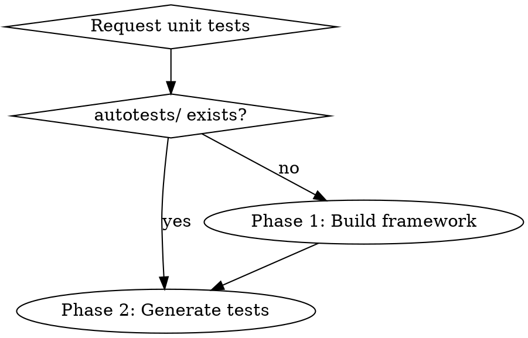

# Generating Qt Unit Tests

## Overview

Two-phase workflow: scaffold test framework with stub-ext into `autotests/`, then generate Google Test code with 100% function coverage and mandatory build verification. Uses codebase-memory-mcp for millisecond-class structure analysis.

## When to Use



- First-time unit test setup for a Qt CMake project
- Generating test cases for a class or module
- Incrementally completing missing test coverage
- **NOT for**: fixing test failures (use `systematic-debugging`), analyzing coverage (use other tools)

## Iron Laws

1. **codebase-memory-mcp required** -- class structure analysis via knowledge graph, 200-3000x faster than per-file LSP
2. **`autotests/`** -- directory must be `autotests/`, never `tests/`
3. **Google Test only** -- fixed framework, no Qt Test or Catch2
4. **100% public/protected coverage** -- every public/protected method needs a test (GUI classes with no testable methods are exempt)
5. **Mandatory build verification** -- compile must succeed before reporting done
6. **Built-in stub-ext** -- copy from `resources/stub/`, never download
7. **No user confirmation** -- execute directly, never use `ask` tool
8. **Sub-agent required** -- delegate all generation work, never do it manually
9. **Trace transitive deps** -- analyze `#include` chains, compile all required source dirs

## Execution Flow

### Step 0: Environment Check (MUST DO FIRST)

**Required dependency**: codebase-memory-mcp must be installed and available.

**Run setup script**:
```bash
bash resources/scripts/setup-codebase-memory.sh
```

**Exit code handling**:
- `0` → Proceed with MCP-based code analysis
- `1-3` → Report error and terminate

### Phase 1: Build Framework (if `autotests/` missing)

1. Create `autotests/{3rdparty/stub/, cmake/}` and copy stub-ext from `resources/stub/`
2. Run `resources/scripts/generate-cmake-utils.sh` to generate `cmake/UnitTestUtils.cmake`
3. Run `resources/scripts/generate-runner.sh` to generate `run-ut.sh` and copy `report_generator/`
4. Delegate to sub-agent (`agent/qt-test-generator.md`) with **phase=1**:
   - Analyze project (CMakeLists.txt, Qt version, deps, source structure)
   - Generate `autotests/CMakeLists.txt` (read template from `resources/templates/cmake-autotests.txt`)
   - Generate test subdirectories and placeholder files
   - Generate `autotests/README.md` (<300 words)
   - Verify cmake configure and build, fix until pass

### Phase 2: Generate Tests

1. Verify `autotests/CMakeLists.txt` and `autotests/3rdparty/stub/` exist
2. **Analyze target classes via MCP (primary)**:
   ```python
   # Check index status
   status = codebase_memory_mcp.index_status(project="project-name")
   
   # Batch fetch classes and methods
   classes = codebase_memory_mcp.search_graph(
       project="project-name",
       label="Class",
       file_pattern="src/lib/ui/*"
   )
   
   methods = codebase_memory_mcp.search_graph(
       project="project-name",
       label="Method",
       qn_pattern=".*ClassName.*"
   )
   
   # Trace dependencies (replaces manual #include recursion)
   callees = codebase_memory_mcp.trace_path(
       function_name="MyClass::method",
       direction="outbound"
   )
   ```
   **LSP as fallback**: Use when precise type inference is needed
3. Delegate to sub-agent (`agent/qt-test-generator.md`) with **phase=2**:
   - **Module batch**: search_graph all classes, fork one sub-agent per class (parallel)
   - **Single class**: one sub-agent
   - **Incremental**: diff existing tests vs all functions, append missing
   - Generate test code (read template: `resources/templates/google-test-base.cpp`)
   - Generate stubs (read patterns: `resources/templates/stub-patterns.cpp`)
   - Smart CMake merge (read template: `resources/templates/cmake-submodule.txt`)
   - Verify build: per-error 3 retries, max 10 loops

## Quick Reference

| Item | Value |
|------|-------|
| Test framework | Google Test only |
| Test file | `test_myclass.cpp` |
| Test class | `MyClassTest` |
| Test case | `{Feature}_{Scenario}_{ExpectedResult}` |
| MCP tools (primary) | `search_graph`, `get_code_snippet`, `trace_path`, `query_graph` |
| LSP tools (fallback) | `lsp_document_symbols`, `lsp_goto_definition`, `lsp_find_references` |
| Stub patterns | `resources/templates/stub-patterns.cpp` |
| CMake templates | `resources/templates/cmake-*.txt` |
| Build retry | Per-error 3x, max 10 loops |
| Sub-agent | `agent/qt-test-generator.md` |
| MCP guide | `resources/references/codebase-memory-guide.md` |

## Red Flags

- `tests/` instead of `autotests/`
- Qt Test or Catch2 framework
- Reporting completion without successful compilation
- Skipping sub-agent delegation
- Using `ask` tool for confirmation
- Downloading stub-ext from internet

## Common Mistakes

| Error | Cause | Fix |
|-------|-------|-----|
| Sub-agent no permissions | Misconfigured | `bash: true, write: allow` |
| Framework not found | Phase 1 skipped | Run Phase 1 first |
| CMake merge conflict | Hardcoded template | AI-driven merge |
| Build fails unreported | Skipped verification | Mandatory build check |
| Incomplete coverage | Missed functions | LSP extract all methods |
| Testing private methods | No access check | Only test public/protected |
| `undefined reference` in link | Missing transitive deps | Trace `#include` chains |
| GUI test segfaults | QApplication without display | Use `QCoreApplication` for Widget classes |
| `stub_ext::freeWrapper` undefined | Missing stub-shadow.cpp | Compile `resources/stub/stub-shadow.cpp` in test target |
| Root CMakeLists broken | Agent modified existing code | Only APPEND, never modify/comment existing blocks |
| Protected method inaccessible | No `using` in test subclass | `using BaseClass::method;` in concrete test class |
