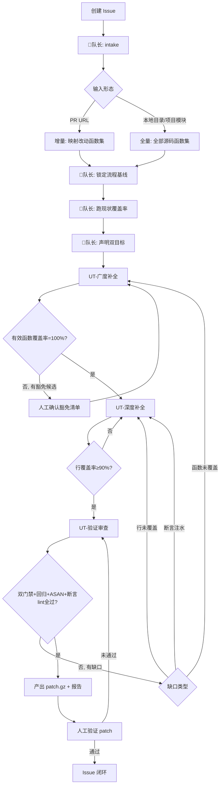

# 单元测试小队设计总纲

> 日期：2026-08-14
>
> 适用范围：Qt/C++ 项目（Deepin/UOS）的自动化单元测试补全与覆盖率提升。
>
> 本小队是**独立小队**，不与 UOS AI 开发小队联动。通用的 Multica 配置与协作规则见 `../最佳实践规则.md`。

---

## 1. 小队定位

小队接收三种形态的输入，输出「广度 + 深度双达标」的单元测试代码，以 `.patch.gz` 交付：

| 输入形态 | 范围边界 | 典型触发 |
|---|---|---|
| GitHub PR URL | **增量**：仅 PR diff 改动的函数 | 开发完功能，给新增代码补测 |
| 本地目录路径 | **全量**：目录内全部源码 | 本地补测、快速验证 |
| 项目 + 模块 | **全量**：指定项目/模块全部源码 | 项目整体覆盖率不达标 |

> **增量边界规则（PR 场景）**：用知识图谱 MCP 把「PR diff 改动文件」映射到「改动函数集合」，广度与深度只针对该集合，patch.gz 只含这些函数的测试。全量场景则覆盖全部非豁免函数。

## 2. 小队编组

四个核心智能体，路由规则由小队指令承载，不设独立路由智能体。

```text
单元测试小队
├── 👑UT-队长/规划（intake + 路由）
│   └── skills: qt-autotest-generator(intake), ut-coverage-verifier(baseline)
├── UT-广度补全
│   └── skills: qt-autotest-generator(threshold=100 + 豁免)
├── UT-深度补全        ⭐ 核心新增能力
│   └── skills: ut-depth-enhancer
└── UT-验证审查
    └── skills: ut-coverage-verifier
```

| 角色 | 主要输入 | 核心职责 | 主要产物 | 缺失影响 |
|---|---|---|---|---|
| 👑UT-队长/规划 | 初始 Issue、评论、目标仓库/分支/路径 | 解析输入形态与目标函数集；锁定流程基线；跑现状覆盖率；设定双目标并路由 | 目标函数集、流程基线、双目标声明、豁免确认门禁 | 目标范围漂移、门禁口径混乱 |
| UT-广度补全 | 流程基线、目标函数集、现状覆盖率 | 逐方法补全，每方法 ≥1 用例；测不到的标豁免候选 | 测试代码、`.ut-exemptions.json` 候选清单 | 广度信号缺失，深度无从谈起 |
| UT-深度补全 | 广度产物、lcov 逐行缺口、源码 | 读源码理解分支/条件/边界/异常，设计针对性用例，强制非 trivial 断言 | 深度测试代码、缺口消解记录 | 行覆盖率上不去，测试无保护价值 |
| UT-验证审查 | 广度+深度产物、流程基线 | 跑全流程统计；核验双门禁+回归+ASAN；断言有效性 lint；出 patch.gz+报告 | `.patch.gz`、`ut-summary.json`、覆盖率报告、断言 lint 结果 | 不达标测试被放过，产出无法追溯 |

## 3. 度量模型（命脉，全队统一口径）

### 3.1 唯一数据源

所有覆盖率判定**只**读取项目自身工具链产出的 `ut-summary.json`，不另造统计：

- 统计脚本：`tests/test-prj-running.sh`（cmake + ASAN/UBSAN + gtest XML + lcov）
- 摘要生成：`tests/gen-ut-summary.py`
- 过滤口径：`lcov --extract '*/src/*'` + `lcov --remove '*/tests/*'`（只统计业务源码，排除测试自身）
- ASAN/UBSAN：脚本已开启（`CMAKE_SAFETYTEST_ARG_ON`），视为硬门禁的一部分

### 3.2 双指标与门禁

| 指标 | 来源字段 | 角色 | 硬门禁 |
|---|---|---|---|
| **函数覆盖率** | `function_coverage.coverage` | **广度信号** | 有效函数覆盖率 = `passed / (total − exempted) × 100%` ≥ **100%** |
| **行覆盖率** | `line_coverage.coverage` | **深度信号** | ≥ **90%** |
| **用例回归** | `test_case.failed` | 回归信号 | = **0** |

> **为什么不引入 branch coverage**：现有工具链零改动即可产出 function/line 两项；line_coverage 的缺口已能反映大部分未覆盖分支；真正的深度由「深度角色读源码理解逻辑」保证，门禁只是兜底。引入 branch coverage 会增加工具链复杂度，投入产出比低。

### 3.3 有效覆盖率公式（统计豁免的核心）

```
原始函数覆盖率 = passed / total × 100%                      ← 报告里如实列出
有效函数覆盖率 = passed / (total − exempted) × 100%          ← 门禁判这个
```

**门禁等价判定**：未覆盖函数集 ⊆ 豁免函数集，且豁免函数全部 `approved=true`。

豁免不是放水，是显式记账——广度角色只能提「候选」，人工确认采用**轻量分级**：

- `gui_event` / `entry_only`：同类**批量预批**（开发者在 Issue 里对整类一次点头即可，不逐项）。
- `ipc_extern` / `hardware`：**逐项确认**（这两类依赖外部系统，豁免理由需人工核实，逐条看 reason）。

批次预批的类在 `.ut-exemptions.json` 中 approved=true；逐项确认的保持 approved=false 直到人工 approve 单条。

### 3.4 豁免分类（仅四类）

| category | 含义 | 示例 |
|---|---|---|
| `gui_event` | GUI 渲染/鼠标/键盘/绘制事件槽，依赖实际绘制 | `onPaintEvent`、`mousePressEvent` |
| `ipc_extern` | DBus / 系统服务外部依赖 | DBus handler、systemd 交互 |
| `hardware` | 设备/硬件/打印依赖 | 打印队列、扫描仪 |
| `entry_only` | main / 事件循环入口 | `main()`、`QApplication::exec` 包装 |

### 3.5 断言有效性硬门禁（防注水）

验证角色对测试文件做 lint，**出现即判不通过**：

| 禁止模式 | 原因 | 正确写法 |
|---|---|---|
| `EXPECT_TRUE(true)` / `SUCCEED()` | 纯凑数 | 删除 |
| `EXPECT_NO_THROW(f())` 作为唯一断言 | 只验「不崩」不验行为 | 补 `EXPECT_EQ(返回值, 期望)` |
| 整个 TEST 无任何引用被测对象可观测值的断言 | 覆盖率绿但无保护 | 至少 1 个断言引用计算/状态/返回值 |
| 断言操作数全为常量、不引用变量 | 假断言 | `EXPECT_EQ(obj.count(), 3)` |

豁免机制管「测不到的」，断言 lint 管「测了但假的」，两者配套才能让「100%」有意义。

## 4. 执行流程



## 5. 交付标准

### 5.1 流程基线（与 UOS AI 小队一致）

- 由 👑UT-队长/规划确定并锁定，全队 checkout 到同一 `full-sha`。
- 格式：`流程基线：<branch> @ <short-sha> <full-sha> "<commit-title>" (<date>)`。
- 返工不更换基线；源码变更（PR 增量场景基线漂移）由队长重新对账。

### 5.2 patch 交付（与最佳实践 4.4 一致）

- 统一 `.patch.gz`，从流程基线到测试代码的完整差异。
- 文件名：`<issue-identifier>-ut-v<version>.patch.gz`，版本递增不覆盖。
- patch **不含**编译产物、源码修改（小队只产出测试，不改源码）、session 文件、缓存。
- 交付评论固定三要素：`base commit SHA` + `patch 类型：全量（gzip）` + 应用命令 `gzip -dc <file>.patch.gz | git apply --3way -`。

### 5.3 状态文件（复用并扩展现有 session）

复用 `autotests/.ut-session.json`，扩展字段：

```json
{
  "targets": {
    "function_coverage_threshold": 100,
    "line_coverage_threshold": 90,
    "scope": "incremental | full",
    "changed_functions": ["Class::method", "..."]
  },
  "exemptions_file": "autotests/.ut-exemptions.json",
  "breadth_status": "pending | done",
  "depth_status": "pending | done",
  "line_coverage": 0,
  "function_coverage_raw": 0,
  "function_coverage_effective": 0,
  "verify_status": "pending | passed | failed"
}
```

## 6. 人工职责

人工只需：

1. 创建 Issue，注明输入形态（PR URL / 本地路径 / 项目+模块）和目标分支，分配给小队。
2. **确认豁免清单**（广度角色产出后分级确认：gui_event/entry_only 批量预批，ipc_extern/hardware 逐项确认）。
3. 下载 `.patch.gz`，在真实环境应用并跑 `test-prj-running.sh` 验证；回复「验证通过」。
4. 在 Issue 反馈结果，闭环。

> 纯智能体内部流转不通知；仅在「豁免确认」「人工验证」「阻塞」三个节点通知（企业微信 webhook）。

## 7. 文件清单

| 文件 | 内容 |
|---|---|
| `squad-instructions.md` | 小队路由指令（leader briefing） |
| `roles/ut-leader.md` | 👑UT-队长/规划 四段式指令 |
| `roles/ut-breadth.md` | UT-广度补全 四段式指令 |
| `roles/ut-depth.md` | UT-深度补全 四段式指令 |
| `roles/ut-verifier.md` | UT-验证审查 四段式指令 |
| `skills/ut-depth-enhancer/SKILL.md` | 深度补全 skill（新建） |
| `skills/ut-coverage-verifier/SKILL.md` | 验证统计 skill（新建，封装项目脚本） |
| `qt-autotest-generator-exemption-patch.md` | 广度 skill 豁免改造说明 |

## 8. Multica 建队落地清单

### 8.1 智能体（4 个）

| 角色名 | 建议 thinking | 建议 max_concurrent | 绑定 skill |
|---|---|---|---|
| UT-队长/规划 | medium | 2 | qt-autotest-generator, ut-coverage-verifier |
| UT-广度补全 | medium | 2 | qt-autotest-generator |
| UT-深度补全 | **high** | 1 | ut-depth-enhancer |
| UT-验证审查 | medium-high | 2 | ut-coverage-verifier |

> 深度角色用 high thinking + 强模型：它是质量关键，最需要代码理解判断。广度是机械生成，现有 skill 成熟，medium 够用。

### 8.2 小队

- 小队名：单元测试小队
- Leader：UT-队长/规划
- instructions：见 `squad-instructions.md`

### 8.3 Workspace

- 默认 v25 功能线团队：`b982c611-c032-4874-ac62-0f66ae001f2f`
- 可复用现有 3 个 UT 智能体（`自动化单元测试` / `-P2` / `P3`）改造为广度角色，再新建深度、验证、队长三个角色。

### 8.4 建队命令示例

```bash
WS="b982c611-c032-4874-ac62-0f66ae001f2f"

# 1. 创建小队（leader 后续指定）
# 2. 创建/改造 4 个智能体，instructions 取 roles/*.md
# 3. 绑定 skill
# 4. 复用 ut-recover.sh 做断点续跑（见 ../ut-recover.sh）
```
